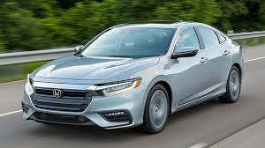

# Apa itu mobil?
## A. Pengertian
**Mobil** (Bahasa Belanda: _automobiel_) adalah kendaraan darat yang digerakkan oleh tenaga mesin, beroda empat atau lebih (selalu genap), biasanya menggunakan bahan bakar minyak (bensin atau solar) untuk menghidupkan mesinnya.
Mobil merupakan kependekan dari otomobil yang berasal dari bahasa Yunani, 'autos' (sendiri) dan bahasa Latin, 'movere' (bergerak).

Berikut adalah contoh mobil:

## B. Bagian-bagian utama
- [Mesin](https://www.google.com/imgres?imgurl=https%3A%2F%2Fimg.mobilmo.com%2F2018%2F01%2F30%2Fcara-kerja-mesin-mob-4fb4.png&imgrefurl=https%3A%2F%2Fmobilmo.com%2Fperawatan-mobil%2Fbegini-cara-kerja-mesin-mobil-sehingga-dapat-berjalan-aid2155&tbnid=ZqLMmNGqdaEPMM&vet=12ahUKEwjWobSR06DoAhVRBrcAHdXLDcAQMygAegUIARCJAg..i&docid=nWcTMHB0XAyjLM&w=730&h=617&q=mesin%20mobil&safe=strict&ved=2ahUKEwjWobSR06DoAhVRBrcAHdXLDcAQMygAegUIARCJAg)
- Ancillary Power
- Penggerak
- Rem
- [Roda dan Ban](https://www.google.com/imgres?imgurl=https%3A%2F%2F3.bp.blogspot.com%2F--urTlL4WNhk%2FWtog27qUfEI%2FAAAAAAAAE_Y%2F_Lzpy59U8DsmeyELot6756fN--B5WkoXgCLcBGAs%2Fs1600%2FCapture.JPG&imgrefurl=https%3A%2F%2Fwww.teknik-otomotif.com%2F2018%2F04%2Ffungsi-dan-bagian-bagian-roda-kendaraan.html&tbnid=6873B4sDxHxStM&vet=12ahUKEwjrpOLF06DoAhWm2nMBHZa-CW0QMygDegUIARDpAQ..i&docid=dY0_LdhVnK4PWM&w=1600&h=959&q=roda%20dan%20ban&safe=strict&ved=2ahUKEwjrpOLF06DoAhWm2nMBHZa-CW0QMygDegUIARDpAQ)
- Setir
- Suspensi
- Bodi
- Perlengkapan interior
- Perlengkapan luar

Catatan: silakan klik link yang ada untuk melihat gambar bagian utama mobil. Tidak semua bagian memiliki gambar yang dapat ditayangkan

## C. Tipe-tipe mobil
### 1. Convertible
Salah satu jenis mobil yang populer di pasaran saat ini adalah tipe mobil conertible. Mobil ini biasanya memiliki bentuk yang kecil dengan bagian atap yang dapat dilipat sehingga membuat pengguna mobil dapat mengubah mobil dari kendaraan tertutup menjadi kendaraan terbuka.

### 2. Coupe
Mobil coupe ini merupakan mobil yang memiliki ukuran kecil dengan jumlah pintu dan jok penumpang berjumlah dua, namun beberapa diantaranya ada yang memiliki jok penumpang berjumlah empat. Ciri lainnya yang bisa anda lihat adalah pada bagian atap mobil.

### 3. Hatchback
Mobil yang masuk ke dalam kategori tipe mobil Hatchback adalah mobil yang bagian kabinnya menyatu dengan ruang bagasi mobil. Biasanya tipe mobil hatchback ini memiliki 5 pintu, 4 pintu khusus digunakan pada penumpang dan 1 pintu lainnya digunakan sebagai pintu bagasi.

### 4. Minivan
Tipe mobil lainnya yang beredar di pasaran saat ini adalah minivan atau yang dikenal dengan nama MPV (Multi Purposes Vehicle). Mobil MPV terbagi ke dalam empat kategori, yaitu tipe LOW MPV, Medium MPV, Luxury MPV, serta High MPV.

### 5. SUV
UV (Sport Utility Vehicle) merupakan jenis mobil yang memadupadankan antara mobil sedan dengan mobil jeep. Mobil SUV terbagi menjadi beberapa kategor, antara lain adalah Low SUV, Medium SUV, High SUV, serta Double Cabin. Prioritas utama dari desain mobil SUV ini adalah dapat digunakan di berbagai medan, bahkan hingga medan yang sulit sekalipun.

### 6. Sedan
Tipe mobil lainnya adalah tipe mobil sedan. Mobil sedan ini didesain dengan bodi mobil yang cukup pendek dan memanjang. Sudah cukup lama sedan menjadi favorit mobil banyak orang karena desainnya yang mewah dan anggun.

Selain itu, masih banyak lagi tipe-tipe mobil lainnya yang belum termasuk kedalam list di atas. (_Baca juga : [10 jenis-jenis mobil dari ciri, contoh, karakter, dan gambar](https://www.otoflik.com/jenis-jenis-mobil/)_ )

sumber : https://id.wikipedia.org/wiki/Mobil